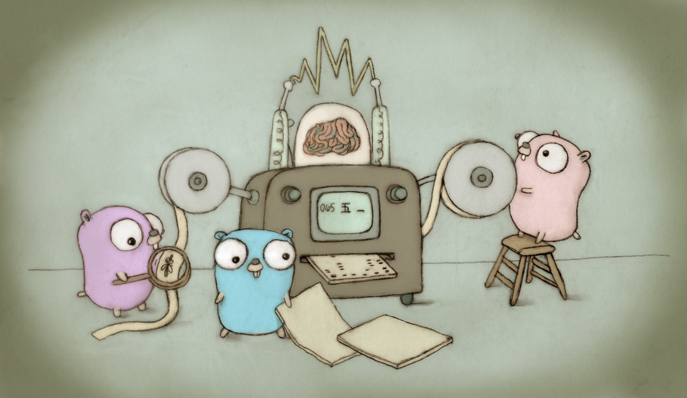

# Go Assessment by DISQO



## Go Documentation:
[](https://go.dev/doc/)

## Required Dependencies:
* Golang **version 1.18**
* Make & Bash
* Docker & Docker-compose
* Mac / Darwin or Linux Operating System

## Run Instructions:
* cd **build** folder and run **make setup**
  * This will spin up the database for you.
  * This command will also wait until you connection is established.
    * Soon as we get a connection, it will create the table **badass_users** for you.
    * You can connect to it easily by using a mysql client:
      * **mysql -u root -ppassword -h0.0.0.0 -P1444 badass_db**
      * then run: **SHOW TABLES;**
      * then run: **DESCRIBE badass_users;**
* finally run **make run** to build then spin up the go microservice.
  * You can optionally run **make build** and **make up** separately. Run performs build then up in that respective order.
    * **make build** will build your microservice.
    * **make up** will run your microservice from your last build.
    * **you can also build this for linux if you're not using a mac**
      * Just add the argument **os=linux** i.e. **make run os=linux**

## Connecting to the database:
* Check **config/cluster/go-assessment-dev** for connection details
* Application is configured to run on port 8080

## Application Demo Instructions:
This application allows you to update, create, delete and get a user from the badass_db database. 

* You can test the health-check endpoint by running **curl -i 0.0.0.0:8080/health-check**

### Create a User
To create a user, you will need to provide the first name and the last name of the user you want to create. 

Example of the body you will need to pass when making a create user `POST` request: **0.0.0.0:8080/user**

``` json
{
    "first_name": "test",
    "last_name": "name"
}

```

### Updating a user
To update a user, you will need to have the id of the user as the a param and also pass the updated first name and the last name in the body. 

Example of the body you wll need yo pass when making a update user `PATCH` request: **0.0.0.0:8080/user/{userId}**

``` json
{
    "first_name": "updated first name",
    "last_name": "updated last namme"
}
```

### Deleting a User
To delete a user, you will only need to pass the ID of the user as a parameter when making the `DELETE` request: **0.0.0.0:8080/user/{userId}**

 curl -i 0.0.0.0:8080/user/5

### Fetching a User
To delete a user, you will only need to pass the ID of the user as a parameter when making the `GET` request: **0.0.0.0:8080/user/{userId}**

**curl -i 0.0.0.0:8080/user/5** 

**For more information about the api routes, check out the [swagger spec](./api/oas3.yml).**
## Other Notes:
* Standard Go Directory Structure: https://github.com/golang-standards/project-layout
